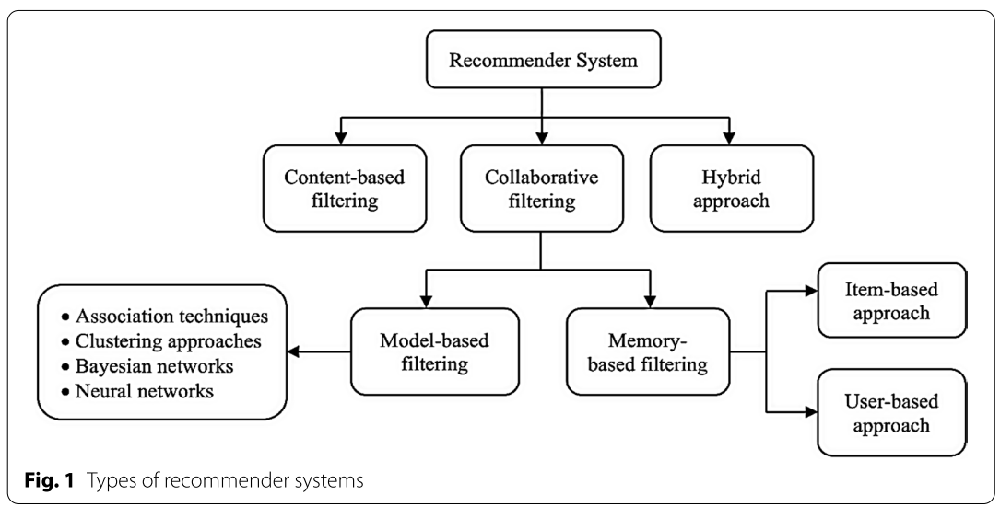
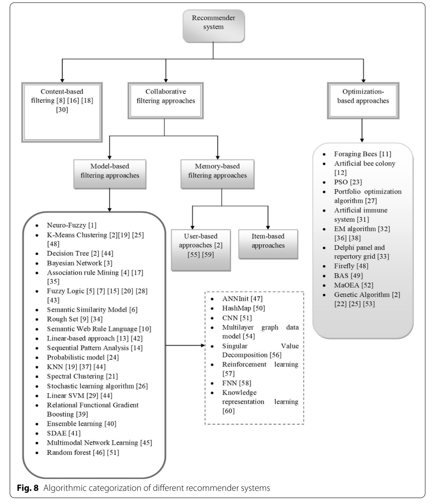

# Objectif

Le premier objectif ici est de travailler sur le remplissage des valeurs manquantes dans la grille de richesse spécifique (et liste des espèces) obtenues à partir des données d'Atlas

# Ressources

[ ] Alexandros Karatzoglou & recommender system  
[ ] https://www.youtube.com/watch?v=G4MBc40rQ2k - simpler method with Python  
[ ] https://builtin.com/data-science/collaborative-filtering-recommender-system

[ ] Ecological interactions and the Netflix problem - [Desjardins-Proulx et al 2017](https://peerj.com/articles/3644/)  
[ ] A systematic review and research perspective on recommender systems - [Roy & Dutta 2022](https://link.springer.com/article/10.1186/s40537-022-00592-5)

[ ] Clarifier recommender system ([content-based filtering](https://www.youtube.com/watch?v=YMZmLx-AUvY), [collaborative filtering](https://www.youtube.com/watch?v=v90un9ALRzw)), KNN algo, random forests, ...
